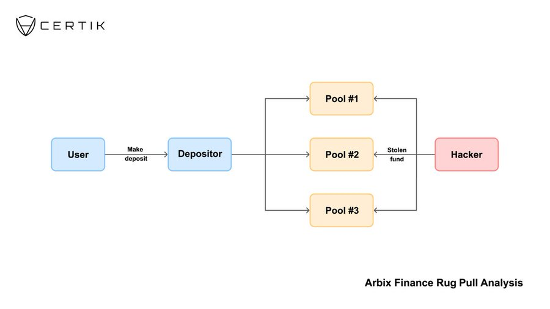
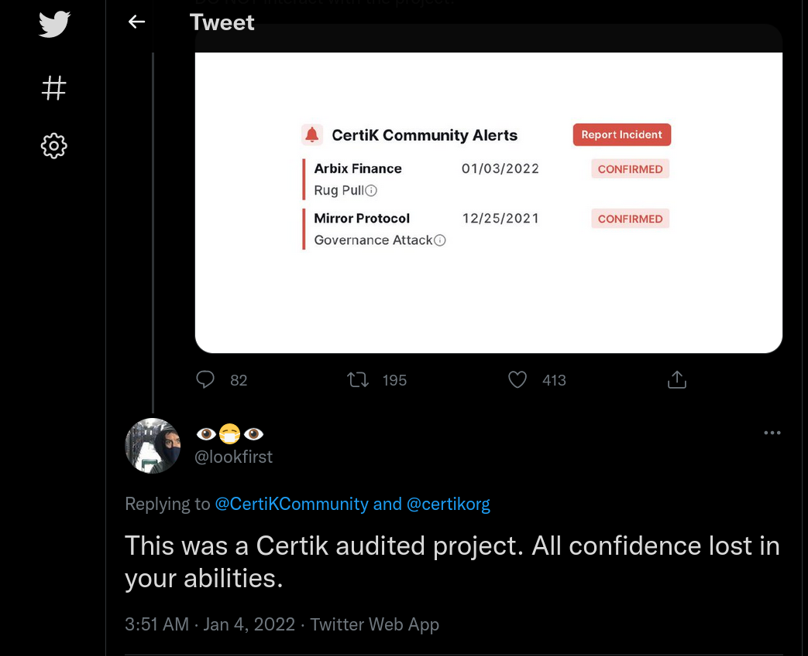

# Incident Analysis👇

* ref:  https://twitter.com/CertiKCommunity/status/1478243729244839938

```
1. $ARBX contract has mint() with onlyOwner function 

2. 10M $ARBX were minted to 8 addresses

3. ~4.5M ARBX were minted to: 0x161262d172699cf0a5e09b6cdfa5fee7f32c183d
4. The 4.5M ARBX were then dumped
```


* The funds deposited by users ($10M) were directed to unverified pools via the depositor contract
* The hacker drained all assets from the pools

```
Depositor address: 
https://bscscan.com/address/0x51cba96bdc2b9ce195d795929b8f99be694a976f#code

1 of the unverified pools:
https://bscscan.com/address/0x135CF5f01CE4f3f651a6fDf338620C768EACe9f1

Hacker address:
https://bscscan.com/address/0x4714a26e4e2e1334c80575332ec9eb043b61a2c4

```



## !!!!




The exploited contract was not in the audit scope that was done for Arbix. The project inserted eight `mint()` functions to a newly deployed ARBX ERC20 contract which allowed the owner to mint any amount of ARBX tokens to any address.
