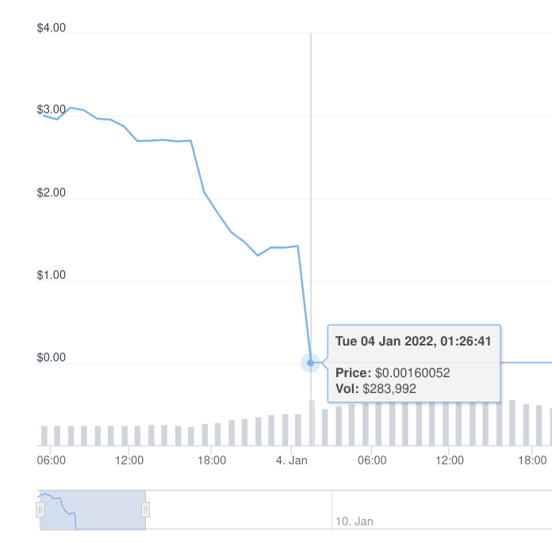
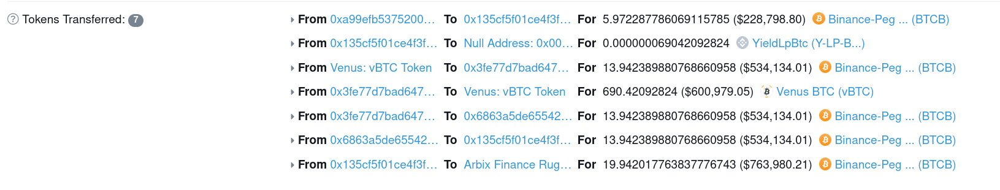

## (1) owner mint


1. $ARBX contract has mint() with onlyOwner function 
  * $ARBX contract = 0xd20ef93050c0943f74f5f8ff0cc97c74139d6437
  * letting 0xfe9972385c56edbb918cc671eda3437a591f8373 (Arbix Finance: Deployer) to mint


```
    abstract contract Context {
    function _msgSender() internal view virtual returns (address payable) {
        return msg.sender;
    }

    address private _owner;
    
    constructor () internal {
        address msgSender = _msgSender();
        _owner = msgSender;

    ...
    }

     function owner() public view virtual returns (address) {
        return _owner;
    }


    modifier onlyOwner() {
        require(owner() == _msgSender(), "Ownable: caller is not the owner");
        _;
    }


pragma solidity 0.6.12;
contract ARBIX is ERC20("ARBIX", "ARBX"), Ownable {
    function mint(address _to, uint256 _amount) public onlyOwner {
        _mint(_to, _amount);
    }
}


```

* [Contract 0xd20ef93050c0943f74f5f8ff0cc97c74139d6437 Created]
* https://bscscan.com/tx/0x4e74587d2ddc6ef1f4d2420f989090dcb3cca175adf4dad1209a29a8a8314b9a

```
From:
0xfe9972385c56edbb918cc671eda3437a591f8373 (Arbix Finance: Deployer)
To:
[Contract 0xd20ef93050c0943f74f5f8ff0cc97c74139d6437 Created] (Arbix Finance: ARBX Token)

```


2. ~4.5M ARBX were minted to: 0x161262d172699cf0a5e09b6cdfa5fee7f32c183d

 * https://bscscan.com/tx/0x4707d30a8d8152eebad1cdcae1d93af24cb9a344b447412ee1d65638b5c3db6f
 * (Dec-10-2021 11:36:08 AM +UTC) 

    ```
    From:
    0xfe9972385c56edbb918cc671eda3437a591f8373 (Arbix Finance: Deployer)
    Interacted With (To):
    Contract 0xd20ef93050c0943f74f5f8ff0cc97c74139d6437 (Arbix Finance: ARBX Token)
    Tokens Transferred:
        From Null Address: 0x000...000
        To 0x161262d172699cf0a5e09b6cdfa5fee7f32c183d For 4,500,000 ARBIX (ARBX) 


Function: mint(address to, uint256 value) ***
0	to	address	0x161262d172699CF0a5e09b6CDfA5fEE7f32c183d
1	value	uint256	4500000000000000000000000
    ```

then dumped when the rugPull started:


## (2) owner drained all assets from the pools

3. 10M $ARBX were minted to 8 addresses


pools:

    * creation of pool#0 : https://bscscan.com/tx/0x6a6c066af6fc0548e88415597dec65b1a3e65229d6f02d3425279b6a0ca40f6b
    * (Nov-21-2021 02:00:23 PM +UTC) 
```
From:
0x4714a26e4e2e1334c80575332ec9eb043b61a2c4 (Arbix Finance Rug Pull)
To:
[Contract 0x135cf5f01ce4f3f651a6fdf338620c768eace9f1 Created]


```


 * beginning with ~$1M in BTCB.
 * https://bscscan.com/tx/0xfbba507c8e90a264d5e77e5db854f5697572da1681f3647d4fa4381f7ef825b9
 * https://dashboard.tenderly.co/tx/bsc/0xfbba507c8e90a264d5e77e5db854f5697572da1681f3647d4fa4381f7ef825b9
 * (Jan-04-2022 03:05:32 AM +UTC) 

```
From:
0x4714a26e4e2e1334c80575332ec9eb043b61a2c4 (Arbix Finance Rug Pull)
Interacted With (To):
Contract 0x135cf5f01ce4f3f651a6fdf338620c768eace9f1         <POOL0>

Input Data: 0x574fb4e3

```




4.
* Once the rug pull had begun,  ~4.5M ARBX were dumped via PancakeSwap, tanking the price from $1.42 to ~$0.00. 
* The 4.5M ARBX were then dumped