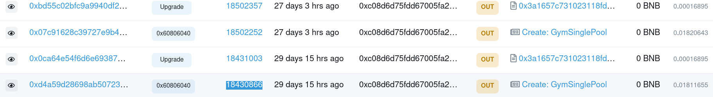

# vol type = “Claim and Pool”


The bug is due to the lack of caller verification, which is exploited to increase the balance without making any payment

This allows the hacker to create fake deposits to the contract, which are processed despite the attacker not spending any coins. The hacker can then simply withdraw their balance of falsely credited deposits.


## sigCalc

```
Keccak-256 
depositFromOtherContract(uint256,uint8,bool,address)
0e3d1093 67ac16b5c44878608f715fd21bdab33f3cb496f9baa834a6a2530c80
```


## fix

update to vol and the fix:



fixed code

