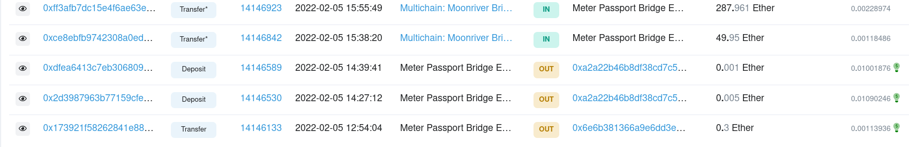
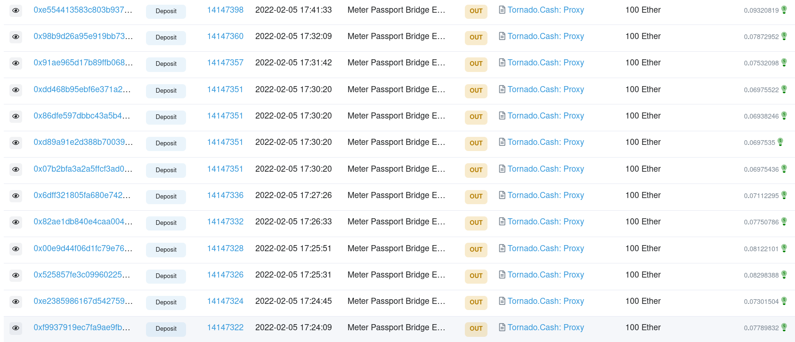

# flow




# (1)

# (2) deposit1

* https://etherscan.io/tx/0x2d3987963b77159cfe4f820532d729b0364c7f05511f23547765c75b110b629c

```
From:
0x8d3d13cac607b7297ff61a5e1e71072758af4d01 (Meter Passport Bridge Exploiter) //hacker
To:
Contract 0xa2a22b46b8df38cd7c55e6bf32ea5a32637cf2b1                     //  Bridge 

```

data

```
Function: deposit(uint8 destinationChainID, bytes32 resourceID, bytes data)

MethodID: 0x05e2ca17
[0]:  0000000000000000000000000000000000000000000000000000000000000001
[1]:  0000000000000000000000c02aaa39b223fe8d0a0e5c4f27ead9083c756cc201
[2]:  0000000000000000000000000000000000000000000000000000000000000060
[3]:  0000000000000000000000000000000000000000000000000000000000000054
[4]:  000000000000000000000000000000000000000000000016e77c77f5de41f3a4
[5]:  0000000000000000000000000000000000000000000000000000000000000014
[6]:  8d3d13cac607b7297ff61a5e1e71072758af4d01000000000000000000000000

```


## (3) deposit2

* https://etherscan.io/tx/0xdfea6413c7eb3068093dcbbe65bcc9ba635e227c35e57fe482bb5923c89e31f7

```
From:
0x8d3d13cac607b7297ff61a5e1e71072758af4d01 (Meter Passport Bridge Exploiter)
To:
Contract 0xa2a22b46b8df38cd7c55e6bf32ea5a32637cf2b1 //  Bridge 

```

```
Function: deposit(uint8 destinationChainID, bytes32 resourceID, bytes data)

MethodID: 0x05e2ca17
[0]:  0000000000000000000000000000000000000000000000000000000000000003
[1]:  0000000000000000000000c02aaa39b223fe8d0a0e5c4f27ead9083c756cc201
[2]:  0000000000000000000000000000000000000000000000000000000000000060
[3]:  0000000000000000000000000000000000000000000000000000000000000054
[4]:  00000000000000000000000000000000000000000000005150ae84a8cdf00000
[5]:  0000000000000000000000000000000000000000000000000000000000000014
[6]:  8d3d13cac607b7297ff61a5e1e71072758af4d01000000000000000000000000
```

# (4) Transfer*

```

From:
0x10c6b61dbf44a083aec3780acf769c77be747e23 (Multichain: Moonriver Bridge)
To:
0x8d3d13cac607b7297ff61a5e1e71072758af4d01 (Meter Passport Bridge Exploiter)
Value:
49.95 Ether - $150K

``` 

# (5) Transfer*

```

From:
0x10c6b61dbf44a083aec3780acf769c77be747e23 (Multichain: Moonriver Bridge)
To:
0x8d3d13cac607b7297ff61a5e1e71072758af4d01 (Meter Passport Bridge Exploiter)
Value:
287.961 Ether  - $860K
```


# deposit to torando



??? where from so many 100ETH ???