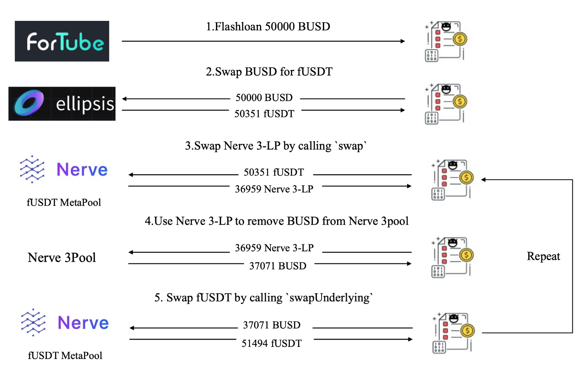

# flash loans and attacks


## flash loan
unsecured loans that don't require collateral from the borrower. Funds are borrowed, used, and returned all within one transaction, and they are typically used to provide leverage in arbitrage opportunities.


## same hack on different protocol

https://bscscan.com/tx/0xea95925eb0438e04d0d81dc270a99ca9fa18b94ca8c6e34272fc9e09266fcf1d



```
    Step 1: borrowing 50,000 BUSD using Flashloan from Fortube
    Step 2: swapping 50,000 BUSD for 50,351 fUSDT from Ellipsis.
    Step 3: invoking the swap function of MetaSwap to swap 50,351 fUSDT for 36,959 Nerve 3-LP with a relatively big slippage.
    Step 4: invoking the removeLiquidityOneCoin function of Nerve.3pool with the LP tokens (received in the previous step) to remove the liquidity of BUSD, i.e., 37,071 BUSD.
    Step 5: invoking the swapUnderlying function of MetaSwap to swap BUSD for fUSDT, and receiving 51,494 fUSDT.

```

 it is possible launch attacks more efficiently, e.g., applying optimized parameters to drain the liquidity in one transaction. The result suggests that the attacker might NOT fully understand the root cause of this vulnerability.