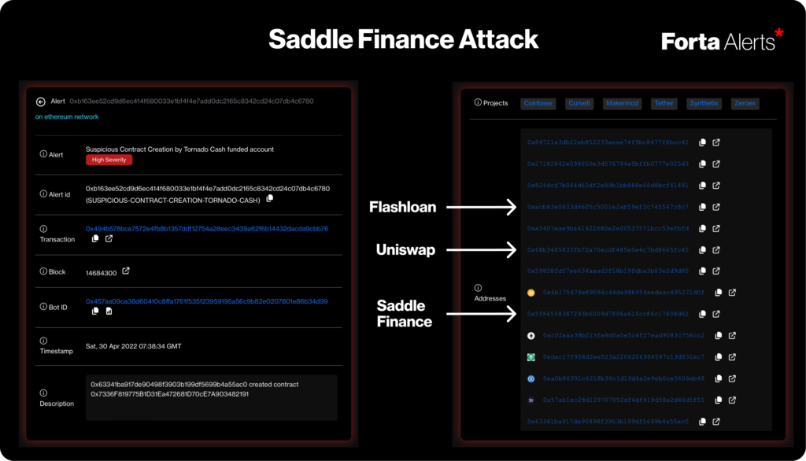

# forta?

* https://twitter.com/FortaNetwork/status/1521288321552560131

In the Saddle Finance attack, where the Uniswap price oracle was manipulated through a flash loan. The created contract contained addresses of the flash loan, Uniswap, as well as Saddle protocol, which could have provided Saddle a heads up before funds were drained that such an attack was about to happen.

