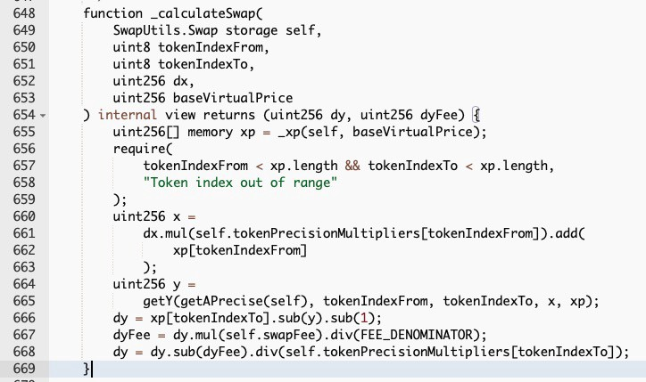
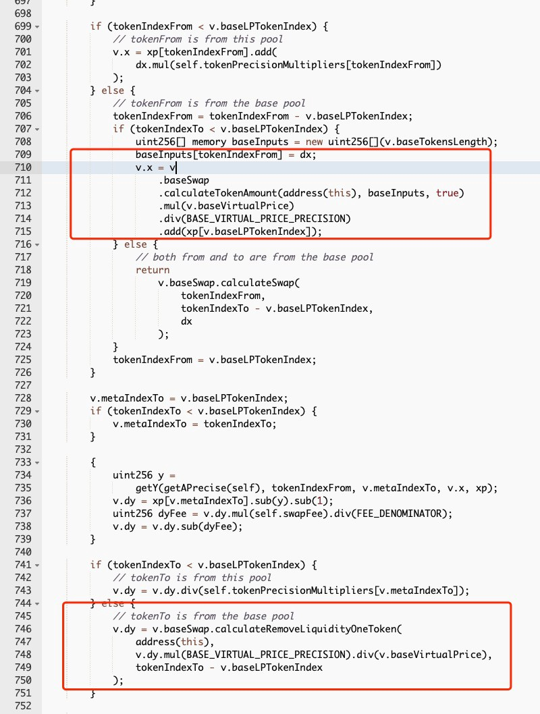

# MetaSwap

* old buggy version: https://etherscan.io/address/0x88cc4aa0dd6cf126b00c012dda9f6f4fd9388b17#code

```
2021-06-14 20:11:22	
Saddle.finance: Deployer	 IN 	 Create
```

* updated: https://etherscan.io/address/0x824dcd7b044d60df2e89b1bb888e66d8bcf41491#code

```
Contract Creation	2021-12-15 0:59:39	
```


fix:
https://github.com/saddle-finance/saddle-contract/pull/469/commits/627cc2dd67db0d1d8a89b392a1421db52041f1ac


## bug

In MetaPool, there are two important functions, i.e., swap and swapUnderlying. Specifically, the former is used to swap the LP token and the pool stablecoin, while the latter is used to swap the pool stablecoin and the underlying stablecoins.

Meanwhile the swap function ignores the impact of the virtual price, which means the value of the LP token will be underestimated. In other words, more LP tokens could be swapped out.

As a result, it is possible to harvest more pool stablecoins by first fetching back the liquidity of the underlying stablecoins with the corresponding LP token, and then swapping pool stablecoins by invoking the swapUnderlying function.





The code snippet in the red rectangle is used to adjust the value of the LP token by measuring the “virtual price” of a LP token (which increases from a baseline value of 1 as more fees come). Meanwhile the swap function ignores the impact of the virtual price, which means the value of the LP token will be underestimated. In other words, more LP tokens could be swapped out.


The code snippet in the red rectangle is used to adjust the value of the LP token by measuring the “virtual price” of a LP token (which increases from a baseline value of 1 as more fees come). Meanwhile the swap function ignores the impact of the virtual price, which means the value of the LP token will be underestimated. In other words, more LP tokens could be swapped out.

