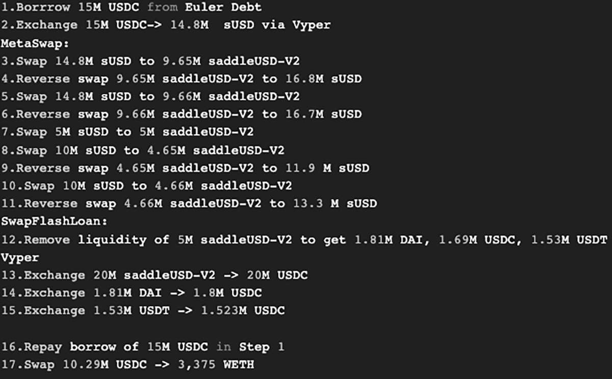

# Saddle Finance hack(2)


## about

* https://rekt.news/saddle-finance-rekt2/
* $11M was stolen from Saddle Finance 
* $3.8M rescued by BlockSec.

* the attacker created an attack contract that was utilized to drain funds through a Uniswap oracle price manipulation.

* An exploiter used a flash loan attack to pull 3,933 ETH (~$11 million) from the "decentralized automated market maker" Saddle Finance. Shortly after the attack, the hacker began moving the stolen funds through the Tornado Cash tumbler to launder the money.

* [about flash loans attacks](./flashLoan.md)

## about the hack

* The funds were taken from the protocol’s sUSDv2 metapool in which Synthetix’ sUSD is paired with saddleUSD-V2 LP tokens (from the DAI, USDC, USDT pool)

* The exploit was possible due to a bug in an old version of the MetaSwapUtils library which doesn’t use a VirturalPrice to calculate the value of the LP token during metapool swaps.

* [metaSwap_contract](metaSwap_contract.md)


### the hack

* The hacker made a series of flash loan assisted sUSD/saddleUSD-V2 swaps in the metapool, manipulating the price of the LP token which could then be swapped back for more sUSD.

* https://etherscan.io/tx/0x2b023d65485c4bb68d781960c2196588d03b871dc9eb1c054f596b7ca6f7da56

* https://etherscan.io/tx/0xe7e0474793aad11875c131ebd7582c8b73499dd3c5a473b59e6762d4e373d7b8





## timeline

* resulting fix to the MetaSwapUtils library was made in December (on Dec 10, 2021)
    https://github.com/saddle-finance/saddle-contract/pull/469/commits

!! the code wasn’t implemented into metapool swaps properly


* Main hack tx for (3375 ETH) : Apr-30-2022 07:40:24 AM +UTC)
```
Interacted With (To):
Contract 0x7336f819775b1d31ea472681d70ce7a903482191
```
* 0x7336f819775b1d31ea472681d70ce7a903482191 created - 2022-04-30 7:38:34


* Second hack tx (for 557 ETH): (Apr-30-2022 08:24:23 AM +UTC)
```
interacted With (To):
Contract 0x797418a5d9dad50ecc0851e0cc23c61ef4c1b9bf 
```
* 0x797418a5d9dad50ecc0851e0cc23c61ef4c1b9bf created - 2022-04-30 8:23:03


BlockSec whitehat tx for (1357 ETH): 
????
https://etherscan.io/tx/0xfc5fb681f54ceb4b0b9db4fcb38204dee7ca89f5cde0ba94179bf1fae563d7db


## source code vs deployed

* [srcVersionsCMP](srcVersionsCMP.md)


## rescue (and respect)
? internal system ?

* A smart contract audit firm called BlockSec was the first to notify Saddle. Interestingly, BlockSec was able to rescue $3.8 million from the exploiters with an "internal system" that can detect and front-run hacking incidents using off-chain arbitrage bots called flashbots.


* https://blocksecteam.medium.com/the-analysis-of-nerve-bridge-security-incident-ead361a21025

## signs
* hacker : 0x63341Ba917De90498F3903B199Df5699b4a55AC0
* initially funded via Tornado Cash
* contract had address [forta agent](forta.md)
* the code wasn’t implemented into metapool swaps properly
