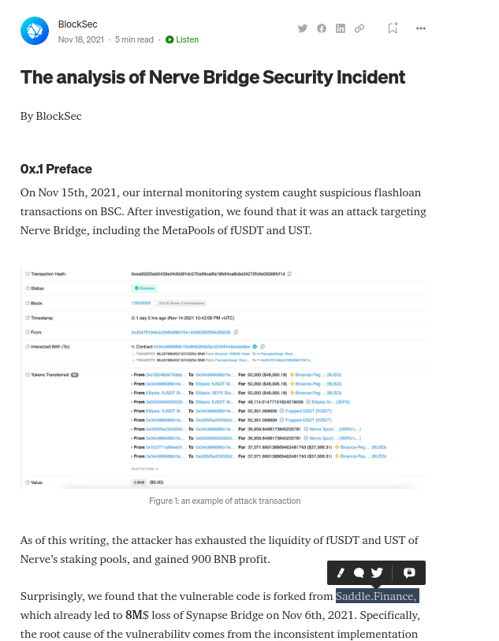

## src cmp? 

old https://etherscan.io/address/0x88cc4aa0dd6cf126b00c012dda9f6f4fd9388b17#code
updated: https://etherscan.io/address/0x824dcd7b044d60df2e89b1bb888e66d8bcf41491#code

src code git: https://github.com/saddle-finance/saddle-contract

## The analysis of Nerve Bridge Security Incident ( Nov 18, 2021 !!! ) 

"Surprisingly, we found that the vulnerable code is forked from Saddle.Finance, "

